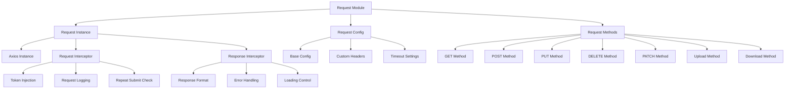
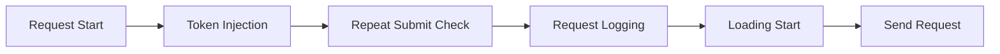
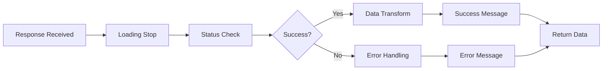
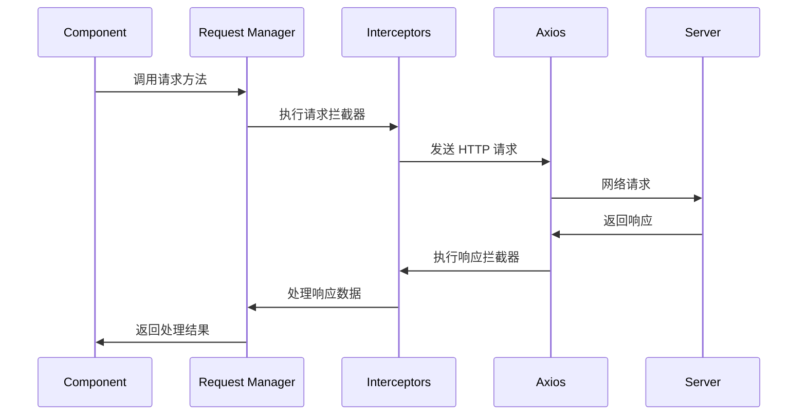
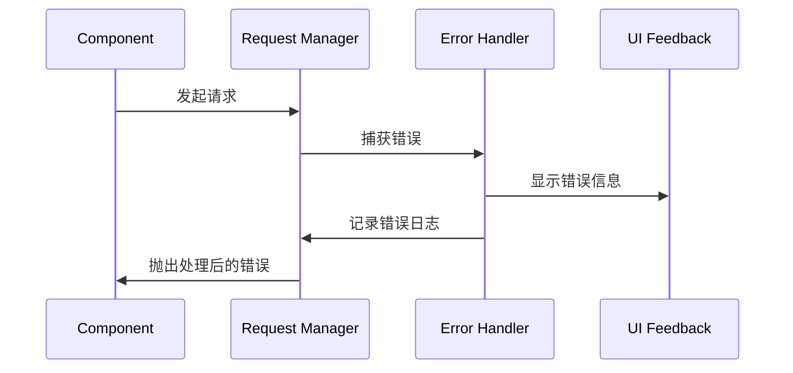
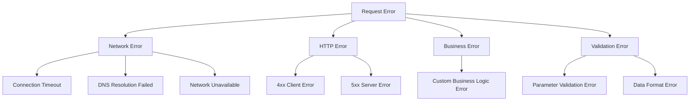

# Axios 请求封装设计文档

## 概述

基于 Lanan-managerment 项目现有的 Http.ts 模块，设计一个更加完善和灵活的 axios 请求封装方案。该方案将提供统一的请求接口、错误处理、拦截器配置和类型安全支持，以满足项目的各种 API 请求需求。

## 技术架构

### 核心组件



### 模块结构

| 模块            | 职责           | 文件                            |
| --------------- | -------------- | ------------------------------- |
| RequestConfig   | 请求配置管理   | `src/utils/request/config.ts`   |
| RequestInstance | Axios 实例创建 | `src/utils/request/instance.ts` |
| RequestMethods  | 请求方法封装   | `src/utils/request/methods.ts`  |
| RequestTypes    | 类型定义       | `src/utils/request/types.ts`    |
| RequestUtils    | 工具函数       | `src/utils/request/utils.ts`    |
| Main Entry      | 统一导出       | `src/utils/request/index.ts`    |

## 请求配置设计

### 基础配置接口

```typescript
interface BaseRequestConfig {
  // 请求基础信息
  baseURL?: string;
  timeout?: number;

  // 认证配置
  withToken?: boolean;
  tokenPrefix?: string;

  // 错误处理
  showErrorMessage?: boolean;
  showSuccessMessage?: boolean;

  // 加载状态
  showLoading?: boolean;
  loadingText?: string;

  // 重复提交控制
  preventRepeatSubmit?: boolean;
  repeatSubmitDelay?: number;

  // 响应数据处理
  transformResponse?: boolean;
  returnFullResponse?: boolean;
}
```

### 请求方法配置

```typescript
interface RequestMethodConfig extends BaseRequestConfig {
  // HTTP 方法
  method: "GET" | "POST" | "PUT" | "DELETE" | "PATCH";

  // 请求数据
  url: string;
  data?: any;
  params?: any;

  // 自定义头部
  headers?: Record<string, any>;

  // 文件上传/下载
  onUploadProgress?: (progressEvent: AxiosProgressEvent) => void;
  onDownloadProgress?: (progressEvent: AxiosProgressEvent) => void;

  // 响应类型
  responseType?: "json" | "blob" | "text" | "arraybuffer";
}
```

## 请求方法设计

### 通用请求方法

```typescript
class RequestManager {
  // 通用请求方法
  async request<T = any>(config: RequestMethodConfig): Promise<T>;

  // 便捷方法
  async get<T = any>(url: string, params?: any, config?: Partial<RequestMethodConfig>): Promise<T>;
  async post<T = any>(url: string, data?: any, config?: Partial<RequestMethodConfig>): Promise<T>;
  async put<T = any>(url: string, data?: any, config?: Partial<RequestMethodConfig>): Promise<T>;
  async delete<T = any>(url: string, params?: any, config?: Partial<RequestMethodConfig>): Promise<T>;
  async patch<T = any>(url: string, data?: any, config?: Partial<RequestMethodConfig>): Promise<T>;

  // 文件操作方法
  async upload<T = any>(url: string, file: File | FormData, config?: UploadConfig): Promise<T>;
  async download(url: string, filename?: string, config?: DownloadConfig): Promise<void>;

  // 批量请求
  async concurrent<T = any>(requests: RequestMethodConfig[]): Promise<T[]>;
  async queue<T = any>(requests: RequestMethodConfig[], concurrency?: number): Promise<T[]>;
}
```

### 特殊请求配置

```typescript
interface UploadConfig extends Partial<RequestMethodConfig> {
  onProgress?: (progressEvent: AxiosProgressEvent) => void;
  multiple?: boolean;
  accept?: string;
  maxSize?: number;
}

interface DownloadConfig extends Partial<RequestMethodConfig> {
  onProgress?: (progressEvent: AxiosProgressEvent) => void;
  saveAs?: boolean;
  filename?: string;
}
```

## 拦截器设计

### 请求拦截器



**功能模块：**

| 功能         | 描述                 | 配置项                     |
| ------------ | -------------------- | -------------------------- |
| 令牌注入     | 自动添加认证令牌     | `withToken`, `tokenPrefix` |
| 重复提交检查 | 防止短时间内重复请求 | `preventRepeatSubmit`      |
| 请求日志     | 记录请求信息用于调试 | `enableRequestLog`         |
| 加载状态     | 显示请求加载动画     | `showLoading`              |

### 响应拦截器



**错误处理策略：**

| 状态码   | 处理方式           | 用户提示                       |
| -------- | ------------------ | ------------------------------ |
| 401      | 清除令牌，跳转登录 | "登录已过期，请重新登录"       |
| 403      | 显示权限错误       | "权限不足，无法访问该资源"     |
| 404      | 显示资源不存在     | "请求的资源不存在"             |
| 422      | 显示参数验证错误   | 后端返回的具体错误信息         |
| 429      | 显示频率限制       | "请求过于频繁，请稍后再试"     |
| 500      | 显示服务器错误     | "服务器内部错误，请联系管理员" |
| 网络错误 | 显示网络异常       | "网络连接异常，请检查网络设置" |

## 数据流程设计

### 请求流程



### 错误流程



## API 使用示例

### 基础用法

```typescript
// 简单 GET 请求
const userData = await request.get<User>("/api/users/profile");

// POST 请求带数据
const result = await request.post<CreateResponse>("/api/users", {
  name: "John Doe",
  email: "john@example.com",
});

// 带配置的请求
const data = await request.get(
  "/api/sensitive-data",
  {},
  {
    withToken: true,
    showLoading: true,
    showErrorMessage: true,
  },
);
```

### 高级用法

```typescript
// 文件上传
await request.upload("/api/upload", file, {
  onProgress: (progress) => {
    console.log(`上传进度: ${progress.loaded}/${progress.total}`);
  },
});

// 文件下载
await request.download("/api/export/users", "users.xlsx", {
  onProgress: (progress) => {
    console.log(`下载进度: ${progress.loaded}/${progress.total}`);
  },
});

// 批量并发请求
const results = await request.concurrent([
  { method: "GET", url: "/api/users" },
  { method: "GET", url: "/api/roles" },
  { method: "GET", url: "/api/permissions" },
]);

// 串行队列请求
const results = await request.queue(
  [
    { method: "POST", url: "/api/step1", data: step1Data },
    { method: "POST", url: "/api/step2", data: step2Data },
    { method: "POST", url: "/api/step3", data: step3Data },
  ],
  2,
); // 最大并发数为 2
```

### 自定义配置

```typescript
// 创建自定义请求实例
const apiRequest = createRequest({
  baseURL: "/api/v1",
  timeout: 15000,
  withToken: true,
  showLoading: true,
});

// 使用自定义实例
const data = await apiRequest.get("/users");
```

## 类型安全设计

### 泛型支持

```typescript
interface ApiResponse<T> {
  code: number;
  message: string;
  data: T;
  success: boolean;
}

interface User {
  id: number;
  name: string;
  email: string;
}

// 类型安全的请求
const user = await request.get<ApiResponse<User>>("/api/users/1");
console.log(user.data.name); // TypeScript 提供完整的类型提示
```

### 响应数据转换

```typescript
interface TransformConfig {
  // 是否自动提取 data 字段
  extractData?: boolean;

  // 自定义转换函数
  transformer?: <T>(response: any) => T;

  // 默认值设置
  defaultValue?: any;
}
```

## 性能优化

### 请求缓存

| 策略       | 使用场景       | 配置                          |
| ---------- | -------------- | ----------------------------- |
| 内存缓存   | 短期数据缓存   | `cache: 'memory'`             |
| 会话存储   | 页面级数据缓存 | `cache: 'session'`            |
| 本地存储   | 长期数据缓存   | `cache: 'local'`              |
| 自定义缓存 | 特殊缓存需求   | `cacheAdapter: CustomAdapter` |

### 请求去重

```typescript
interface DedupeConfig {
  // 启用请求去重
  enabled?: boolean;

  // 去重键生成策略
  keyGenerator?: (config: RequestConfig) => string;

  // 去重时间窗口（毫秒）
  window?: number;
}
```

### 请求重试

```typescript
interface RetryConfig {
  // 重试次数
  times?: number;

  // 重试延迟（毫秒）
  delay?: number;

  // 重试条件
  condition?: (error: any) => boolean;

  // 延迟策略
  delayStrategy?: "fixed" | "exponential" | "linear";
}
```

## 错误处理机制

### 错误分类



### 错误处理策略

```typescript
interface ErrorHandlingConfig {
  // 全局错误处理器
  globalHandler?: (error: RequestError) => void;

  // 特定错误处理器
  handlers?: {
    [errorCode: number]: (error: RequestError) => void;
  };

  // 错误重试配置
  retry?: RetryConfig;

  // 错误上报配置
  reporting?: {
    enabled: boolean;
    endpoint: string;
    includeRequestData: boolean;
  };
}
```

## 测试策略

### 单元测试覆盖

| 测试模块 | 测试内容           | 覆盖率目标 |
| -------- | ------------------ | ---------- |
| 请求方法 | 各种 HTTP 方法调用 | 100%       |
| 拦截器   | 请求/响应拦截逻辑  | 95%        |
| 错误处理 | 各种错误场景       | 90%        |
| 配置管理 | 配置合并和验证     | 95%        |
| 工具函数 | 辅助功能函数       | 100%       |

### 集成测试

```typescript
describe("Request Integration Tests", () => {
  test("完整请求流程测试", async () => {
    // 测试从发起请求到接收响应的完整流程
  });

  test("错误处理集成测试", async () => {
    // 测试各种错误场景的处理
  });

  test("拦截器链测试", async () => {
    // 测试多个拦截器的协同工作
  });
});
```

## 兼容性考虑

### 浏览器兼容性

| 浏览器  | 最低版本 | 说明         |
| ------- | -------- | ------------ |
| Chrome  | 88+      | 支持所有功能 |
| Firefox | 85+      | 支持所有功能 |
| Safari  | 14+      | 支持所有功能 |
| Edge    | 88+      | 支持所有功能 |

### 向后兼容

```typescript
// 保持与现有 Http.ts 的兼容性
export const legacyRequest = {
  get: request.get,
  post: request.post,
  put: request.put,
  delete: request.delete,
};

// 默认导出保持原有接口
export default legacyRequest;
```
