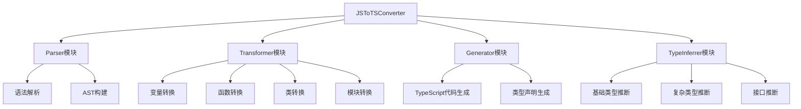
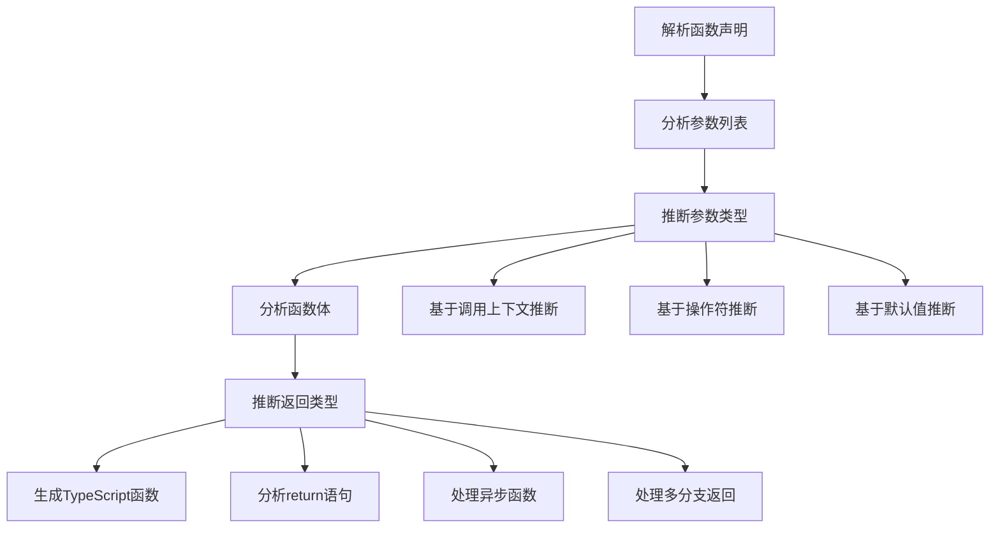

# JavaScript到TypeScript转换工具设计文档

## 概述

本文档描述了一个用于将JavaScript代码转换为TypeScript代码的工具函数设计。该工具函数将集成到Lanan-managerment项目的utils工具库中，提供基础的代码转换功能，包括类型推断、语法转换和类型注解添加等。

## 架构设计

### 核心模块架构



### 转换流程


## 功能模块设计

### 1. 核心转换器类

#### JSToTSConverter

**职责**: 作为转换工具的主入口，协调各个子模块完成转换任务

**主要方法**:

- `convert(jsCode: string): ConversionResult` - 主转换方法
- `convertFile(filePath: string): ConversionResult` - 文件转换方法
- `setConfig(config: ConversionConfig): void` - 设置转换配置

### 2. 解析器模块

#### JSParser

**职责**: 解析JavaScript代码，构建抽象语法树(AST)

**核心功能**:

- 词法分析：将源代码分解为token
- 语法分析：根据JavaScript语法规则构建AST
- 错误处理：识别并报告语法错误

**支持的语法**:

- 变量声明 (var, let, const)
- 函数声明和表达式
- 类声明
- 对象和数组字面量
- 控制流语句
- 模块导入导出

### 3. 类型推断模块

#### TypeInferrer

**职责**: 分析JavaScript代码并推断可能的TypeScript类型

**推断策略**:

| 场景     | 推断规则           | 示例                                                             |
| -------- | ------------------ | ---------------------------------------------------------------- |
| 字面量   | 直接映射到对应类型 | `42` → `number`                                                  |
| 函数参数 | 基于使用上下文推断 | `function add(a, b) { return a + b }` → `(a: number, b: number)` |
| 变量赋值 | 基于初始值推断     | `let name = "John"` → `let name: string`                         |
| 对象属性 | 递归推断属性类型   | `{id: 1, name: "John"}` → `{id: number; name: string}`           |
| 数组元素 | 推断元素联合类型   | `[1, "hello", true]` → `(number \| string \| boolean)[]`         |

#### 高级类型推断

**函数返回类型推断**:

- 分析return语句
- 处理多分支返回
- 推断Promise和async函数返回类型

**复杂对象类型推断**:

- 嵌套对象结构分析
- 动态属性处理
- 方法类型推断

### 4. 语法转换模块

#### SyntaxTransformer

**职责**: 将JavaScript语法转换为TypeScript语法

**转换规则**:

##### 变量声明转换

```javascript
// JavaScript
var name = "John";
let age = 25;
const isActive = true;

// TypeScript (转换后)
var name: string = "John";
let age: number = 25;
const isActive: boolean = true;
```

##### 函数转换

```javascript
// JavaScript
function greet(name) {
    return "Hello, " + name;
}

// TypeScript (转换后)
function greet(name: string): string {
    return "Hello, " + name;
}
```

##### 类转换

```javascript
// JavaScript
class User {
    constructor(name, email) {
        this.name = name;
        this.email = email;
    }

    getName() {
        return this.name;
    }
}

// TypeScript (转换后)
class User {
    name: string;
    email: string;

    constructor(name: string, email: string) {
        this.name = name;
        this.email = email;
    }

    getName(): string {
        return this.name;
    }
}
```

### 5. 代码生成模块

#### TSGenerator

**职责**: 根据转换后的AST生成TypeScript代码

**生成策略**:

- 保持原有代码格式
- 添加类型注解
- 生成类型声明文件(.d.ts)
- 优化import/export语句

## 数据类型设计

### 配置类型

```typescript
interface ConversionConfig {
  // 是否生成严格类型
  strict: boolean;
  // 是否推断函数返回类型
  inferReturnTypes: boolean;
  // 是否生成接口定义
  generateInterfaces: boolean;
  // 目标TypeScript版本
  target: "ES5" | "ES2015" | "ES2017" | "ES2018" | "ES2019" | "ES2020";
  // 是否保留注释
  preserveComments: boolean;
  // 类型推断精度
  inferenceLevel: "basic" | "advanced" | "strict";
}
```

### 转换结果类型

```typescript
interface ConversionResult {
  // 转换后的TypeScript代码
  tsCode: string;
  // 生成的类型声明
  typeDeclarations: string;
  // 转换统计信息
  statistics: ConversionStatistics;
  // 警告和建议
  warnings: ConversionWarning[];
  // 是否转换成功
  success: boolean;
  // 错误信息
  errors?: ConversionError[];
}

interface ConversionStatistics {
  // 转换的变量数量
  variablesConverted: number;
  // 转换的函数数量
  functionsConverted: number;
  // 转换的类数量
  classesConverted: number;
  // 推断的类型数量
  typesInferred: number;
  // 转换耗时
  conversionTime: number;
}
```

### AST节点类型

```typescript
interface ASTNode {
  type: NodeType;
  start: number;
  end: number;
  children?: ASTNode[];
}

interface VariableNode extends ASTNode {
  type: "VariableDeclaration";
  identifier: string;
  valueType: TypeInfo;
  initializer?: ASTNode;
}

interface FunctionNode extends ASTNode {
  type: "FunctionDeclaration";
  name: string;
  parameters: ParameterNode[];
  returnType: TypeInfo;
  body: ASTNode;
}

interface TypeInfo {
  name: string;
  isOptional: boolean;
  isArray: boolean;
  unionTypes?: TypeInfo[];
  properties?: Record<string, TypeInfo>;
}
```

## 核心算法设计

### 类型推断算法

#### 基础类型推断

```typescript
class TypeInferrer {
  inferPrimitiveType(value: any): TypeInfo {
    if (typeof value === "string") return { name: "string", isOptional: false, isArray: false };
    if (typeof value === "number") return { name: "number", isOptional: false, isArray: false };
    if (typeof value === "boolean") return { name: "boolean", isOptional: false, isArray: false };
    if (value === null) return { name: "null", isOptional: false, isArray: false };
    if (value === undefined) return { name: "undefined", isOptional: false, isArray: false };
    return { name: "any", isOptional: false, isArray: false };
  }
}
```

#### 复杂类型推断

**对象类型推断流程**:

1. 遍历对象所有属性
2. 递归推断每个属性的类型
3. 检查属性是否可选
4. 构建接口类型定义

**数组类型推断流程**:

1. 分析数组所有元素
2. 确定元素类型的联合
3. 判断是否为元组类型
4. 生成数组类型注解

### 语法转换算法

#### 函数转换算法



#### 变量转换算法

**转换步骤**:

1. 识别变量声明关键字(var/let/const)
2. 提取变量名和初始值
3. 推断变量类型
4. 生成带类型注解的声明

## 错误处理和验证

### 错误分类

| 错误类型     | 描述                 | 处理策略               |
| ------------ | -------------------- | ---------------------- |
| 语法错误     | JavaScript语法不正确 | 报告具体位置和错误信息 |
| 类型推断失败 | 无法确定变量类型     | 使用any类型并发出警告  |
| 转换冲突     | TypeScript关键字冲突 | 自动重命名或提示用户   |
| 兼容性问题   | 目标版本不支持某特性 | 提供替代方案或降级处理 |

### 验证机制

**输入验证**:

- 检查JavaScript代码语法正确性
- 验证配置参数有效性
- 确保文件路径存在性

**输出验证**:

- 验证生成的TypeScript代码语法正确性
- 检查类型注解完整性
- 确保转换结果的一致性

## 性能优化策略

### 内存优化

**AST缓存机制**:

- 缓存已解析的AST节点
- 增量解析大文件
- 及时释放不需要的节点

**类型推断缓存**:

- 缓存常见类型推断结果
- 复用相似结构的类型信息
- 优化递归推断性能

### 速度优化

**并行处理**:

- 多文件并行转换
- 模块级别的并行分析
- 异步类型推断

**算法优化**:

- 使用高效的AST遍历算法
- 优化类型推断算法复杂度
- 实现增量转换支持

## 扩展性设计

### 插件机制

**转换插件接口**:

```typescript
interface TransformPlugin {
  name: string;
  version: string;
  transform(node: ASTNode, context: TransformContext): ASTNode;
  supports(nodeType: NodeType): boolean;
}
```

**类型推断插件**:

```typescript
interface TypeInferencePlugin {
  name: string;
  inferType(node: ASTNode, context: InferenceContext): TypeInfo | null;
  priority: number;
}
```

### 自定义规则

**转换规则配置**:

- 自定义命名约定
- 特定库的类型映射
- 代码风格偏好设置

**类型映射规则**:

- 第三方库类型映射
- 自定义类型别名
- 条件类型推断规则

## 集成方案

### 工具函数接口设计

```typescript
// 主要导出接口
export interface JSToTSConverterOptions {
  config?: Partial<ConversionConfig>;
  plugins?: TransformPlugin[];
}

export function convertJSToTS(jsCode: string, options?: JSToTSConverterOptions): Promise<ConversionResult>;

export function convertJSFileToTS(
  inputPath: string,
  outputPath?: string,
  options?: JSToTSConverterOptions,
): Promise<ConversionResult>;

export function createConverter(config: ConversionConfig): JSToTSConverter;
```

### 项目集成

**文件位置**: `src/utils/jsToTsConverter.ts`

**使用示例**:

```typescript
import { convertJSToTS, convertJSFileToTS } from "@/utils/jsToTsConverter";

// 转换代码字符串
const result = await convertJSToTS(`
  function greet(name) {
    return "Hello, " + name;
  }
`);

// 转换文件
const fileResult = await convertJSFileToTS("./legacy/utils.js", "./src/utils/utils.ts");
```

## 单元测试策略

### 测试用例分类

**基础功能测试**:

- 变量声明转换测试
- 函数声明转换测试
- 类声明转换测试
- 模块导入导出测试

**类型推断测试**:

- 基础类型推断准确性
- 复杂对象类型推断
- 函数参数和返回类型推断
- 边界情况处理

**错误处理测试**:

- 语法错误处理
- 转换失败恢复
- 警告信息生成
- 配置验证

### 测试数据

**输入测试用例**:

```javascript
// 测试用例1: 基础变量声明
var name = "John";
let age = 25;
const isActive = true;

// 测试用例2: 函数声明
function calculateArea(width, height) {
  return width * height;
}

// 测试用例3: 类声明
class User {
  constructor(name, email) {
    this.name = name;
    this.email = email;
  }
}
```

**期望输出**:

```typescript
// 期望输出1
var name: string = "John";
let age: number = 25;
const isActive: boolean = true;

// 期望输出2
function calculateArea(width: number, height: number): number {
  return width * height;
}

// 期望输出3
class User {
  name: string;
  email: string;

  constructor(name: string, email: string) {
    this.name = name;
    this.email = email;
  }
}
```
