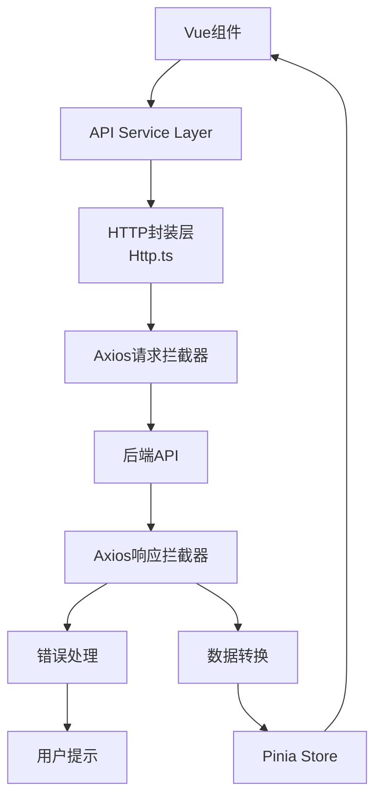
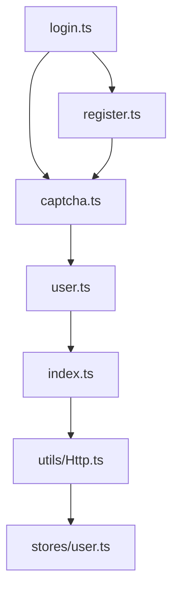

# 登录和注册API网络请求设计文档

## 1. 概述

### 1.1 项目背景

Lanan-managerment 是一个基于 Vue 3 和 TypeScript 的前端管理系统，当前使用 mock 数据进行开发。需要完善登录和注册功能的网络请求部分，连接真实的后端API接口。

### 1.2 设计目标

- 标准化登录和注册API接口设计
- 完善网络请求封装和错误处理
- 统一响应数据格式和错误码规范
- 提供类型安全的TypeScript接口定义
- 支持token认证和状态管理

## 2. 技术架构

### 2.1 现有技术栈

- **前端框架**: Vue 3.5.18 + TypeScript 5.8.0
- **HTTP客户端**: Axios 1.11.0 (已封装在 Http.ts 中)
- **状态管理**: Pinia 3.0.3
- **UI组件库**: Element Plus 2.10.7
- **构建工具**: Vite 7.0.6

### 2.2 网络请求架构图



## 3. API接口规范

### 3.1 基础配置

| 配置项       | 值                 | 说明        |
| ------------ | ------------------ | ----------- |
| Base URL     | `/api`             | API基础路径 |
| 请求超时     | 30000ms            | 30秒超时    |
| Content-Type | `application/json` | JSON格式    |
| 认证方式     | `Bearer Token`     | JWT令牌认证 |

### 3.2 通用响应格式

```typescript
interface ApiResponse<T = any> {
  code: number; // 状态码
  message: string; // 响应消息
  data?: T; // 响应数据
  success: boolean; // 是否成功
  timestamp?: number; // 时间戳
}
```

### 3.3 错误码规范

| 状态码 | 说明               | 处理方式       |
| ------ | ------------------ | -------------- |
| 200    | 请求成功           | 正常处理数据   |
| 400    | 请求参数错误       | 提示参数错误   |
| 401    | 认证失败/Token过期 | 跳转登录页     |
| 403    | 权限不足           | 提示权限不足   |
| 404    | 资源不存在         | 提示资源不存在 |
| 500    | 服务器内部错误     | 提示服务器错误 |

## 4. 登录API设计

### 4.1 接口信息

| 属性     | 值                         |
| -------- | -------------------------- |
| 接口路径 | `/login`                   |
| 请求方式 | POST                       |
| 认证要求 | 无 (isToken: false)        |
| 重复提交 | 禁止 (repeatSubmit: false) |

### 4.2 请求参数

```typescript
interface LoginRequest {
  username: string; // 用户名
  password: string; // 密码
  code: string; // 验证码
  uuid: string; // 验证码唯一标识
}
```

### 4.3 响应数据

```typescript
interface LoginResponse {
  code: number; // 状态码
  msg: string; // 响应消息
  data: {
    token: string; // JWT令牌
    expiresIn: number; // 过期时间(秒)
    userInfo: {
      id: number;
      username: string;
      nickname: string;
      avatar?: string;
      role: string;
      permissions: string[];
      department?: string;
      position?: string;
      email?: string;
    };
  };
}
```

### 4.4 API实现代码

**文件路径: `src/api/login.ts`**

```typescript
import request from "@/utils/request";

// 登录方法
export function login(username: string, password: string, code: string, uuid: string) {
  const data = {
    username,
    password,
    code,
    uuid,
  };
  return request({
    url: "/login",
    headers: {
      isToken: false,
      repeatSubmit: false,
    },
    method: "post",
    data: data,
  });
}

// 登录相关类型定义
export interface LoginRequest {
  username: string;
  password: string;
  code: string;
  uuid: string;
}

export interface LoginResponse {
  code: number;
  msg: string;
  data: {
    token: string;
    expiresIn: number;
    userInfo: {
      id: number;
      username: string;
      nickname: string;
      avatar?: string;
      role: string;
      permissions: string[];
      department?: string;
      position?: string;
      email?: string;
    };
  };
}
```

## 5. 注册API设计

### 5.1 接口信息

| 属性     | 值                  |
| -------- | ------------------- |
| 接口路径 | `/register`         |
| 请求方式 | POST                |
| 认证要求 | 无 (isToken: false) |

### 5.2 请求参数

```typescript
interface RegisterRequest {
  username: string; // 用户名(手机号)
  password: string; // 密码
  confirmPassword?: string; // 确认密码(前端验证)
  nickname?: string; // 昵称
  email?: string; // 邮箱
  phone?: string; // 手机号
  code?: string; // 验证码
  uuid?: string; // 验证码标识
  // 其他业务字段根据实际需求添加
}
```

### 5.3 响应数据

```typescript
interface RegisterResponse {
  code: number; // 状态码
  msg: string; // 注册结果消息
  data?: {
    userId?: number; // 用户ID
    message?: string; // 成功消息
  };
}
```

### 5.4 API实现代码

**文件路径: `src/api/register.ts`**

```typescript
import request from "@/utils/request";

// 注册方法
export function register(data: RegisterRequest) {
  return request({
    url: "/register",
    headers: {
      isToken: false,
    },
    method: "post",
    data: data,
  });
}

// 注册相关类型定义
export interface RegisterRequest {
  username: string;
  password: string;
  confirmPassword?: string;
  nickname?: string;
  email?: string;
  phone?: string;
  code?: string;
  uuid?: string;
  [key: string]: any; // 允许其他业务字段
}

export interface RegisterResponse {
  code: number;
  msg: string;
  data?: {
    userId?: number;
    message?: string;
  };
}
```

## 6. 验证码API设计

### 6.1 获取图形验证码

| 属性     | 值                  |
| -------- | ------------------- |
| 接口路径 | `/captchaImage`     |
| 请求方式 | GET                 |
| 认证要求 | 无 (isToken: false) |
| 超时时间 | 20000ms             |

**响应数据:**

```typescript
interface CaptchaResponse {
  code: number; // 状态码
  msg: string; // 响应消息
  data: {
    uuid: string; // 验证码唯一标识
    img: string; // Base64图片数据
  };
}
```

### 6.2 API实现代码

**文件路径: `src/api/captcha.ts`**

```typescript
import request from "@/utils/request";

// 获取验证码
export function getCodeImg() {
  return request({
    url: "/captchaImage",
    headers: {
      isToken: false,
    },
    method: "get",
    timeout: 20000,
  });
}

// 验证码相关类型定义
export interface CaptchaResponse {
  code: number;
  msg: string;
  data: {
    uuid: string;
    img: string;
  };
}
```

## 7. 用户信息API设计

### 7.1 获取用户信息

| 属性     | 值                      |
| -------- | ----------------------- |
| 接口路径 | `/getInfo`              |
| 请求方式 | GET                     |
| 认证要求 | Bearer Token (需要登录) |

**响应数据:**

```typescript
interface UserInfoResponse {
  code: number;
  msg: string;
  data: {
    user: UserInfo;
    roles: string[];
    permissions: string[];
  };
}
```

### 7.2 用户登出

| 属性     | 值                      |
| -------- | ----------------------- |
| 接口路径 | `/logout`               |
| 请求方式 | POST                    |
| 认证要求 | Bearer Token (需要登录) |

### 7.3 API实现代码

**文件路径: `src/api/user.ts`**

```typescript
import request from "@/utils/request";

// 获取用户详细信息
export function getInfo() {
  return request({
    url: "/getInfo",
    method: "get",
  });
}

// 退出登录
export function logout() {
  return request({
    url: "/logout",
    method: "post",
  });
}

// 用户相关类型定义
export interface UserInfo {
  id: number;
  username: string;
  nickname: string;
  avatar?: string;
  role: string;
  permissions: string[];
  department?: string;
  position?: string;
  email?: string;
}

export interface UserInfoResponse {
  code: number;
  msg: string;
  data: {
    user: UserInfo;
    roles: string[];
    permissions: string[];
  };
}

export interface LogoutResponse {
  code: number;
  msg: string;
  data?: any;
}
```

## 8. 网络请求实现架构

### 8.1 API服务层结构



### 8.2 文件组织结构

```
src/
├── api/
│   ├── login.ts         # 登录相关API
│   ├── register.ts      # 注册相关API
│   ├── captcha.ts       # 验证码相关API
│   ├── user.ts          # 用户信息API
│   └── index.ts         # API统一导出
├── types/
│   ├── auth.ts          # 认证类型定义
│   └── api.ts           # 通用API类型
├── utils/
│   ├── Http.ts          # HTTP请求封装(已存在)
│   └── request.ts       # 请求工具(已存在)
└── stores/
    └── user.ts          # 用户状态管理(已存在)
```

### 8.3 API统一导出文件

**文件路径: `src/api/index.ts`**

```typescript
// 登录相关API
export * from "./login";

// 注册相关API
export * from "./register";

// 验证码相关API
export * from "./captcha";

// 用户信息API
export * from "./user";

// 统一导出所有API
export {
  // 登录
  login,
  // 注册
  register,
  // 验证码
  getCodeImg,
  // 用户信息
  getInfo,
  logout,
} from "./login";
export { register } from "./register";
export { getCodeImg } from "./captcha";
export { getInfo, logout } from "./user";
```

## 9. 使用示例

### 9.1 在登录组件中使用

```typescript
// LoginView.vue
<script setup lang="ts">
import { ref } from 'vue'
import { login, getCodeImg, type LoginRequest } from '@/api/login'
import { type CaptchaResponse } from '@/api/captcha'
import { useUserStore } from '@/stores/user'
import { ElMessage } from 'element-plus'

const userStore = useUserStore()

// 登录表单数据
const loginForm = ref<LoginRequest>({
  username: '',
  password: '',
  code: '',
  uuid: ''
})

// 验证码图片
const codeUrl = ref('')

// 获取验证码
const getCaptcha = async () => {
  try {
    const response: CaptchaResponse = await getCodeImg()
    if (response.code === 200) {
      codeUrl.value = 'data:image/gif;base64,' + response.data.img
      loginForm.value.uuid = response.data.uuid
    }
  } catch (error) {
    ElMessage.error('获取验证码失败')
  }
}

// 登录处理
const handleLogin = async () => {
  try {
    const response = await login(
      loginForm.value.username,
      loginForm.value.password,
      loginForm.value.code,
      loginForm.value.uuid
    )

    if (response.code === 200) {
      // 保存用户信息到store
      userStore.setToken(response.data.token)
      userStore.setUserInfo(response.data.userInfo)

      ElMessage.success('登录成功')
      // 跳转到首页
      router.push('/')
    }
  } catch (error) {
    ElMessage.error('登录失败')
    // 重新获取验证码
    getCaptcha()
  }
}

// 初始化获取验证码
getCaptcha()
</script>
```

### 9.2 在注册组件中使用

```typescript
// RegisterView.vue
<script setup lang="ts">
import { ref } from 'vue'
import { register, type RegisterRequest } from '@/api/register'
import { getCodeImg } from '@/api/captcha'
import { ElMessage } from 'element-plus'
import router from '@/router'

// 注册表单数据
const registerForm = ref<RegisterRequest>({
  username: '',
  password: '',
  confirmPassword: '',
  nickname: '',
  email: '',
  code: '',
  uuid: ''
})

// 注册处理
const handleRegister = async () => {
  try {
    // 前端验证
    if (registerForm.value.password !== registerForm.value.confirmPassword) {
      ElMessage.error('两次密码输入不一致')
      return
    }

    const response = await register(registerForm.value)

    if (response.code === 200) {
      ElMessage.success('注册成功')
      // 跳转到登录页
      router.push('/login')
    }
  } catch (error) {
    ElMessage.error('注册失败')
  }
}
</script>
```

### 9.3 在用户信息组件中使用

```typescript
// UserProfile.vue
<script setup lang="ts">
import { ref, onMounted } from 'vue'
import { getInfo, logout, type UserInfo } from '@/api/user'
import { useUserStore } from '@/stores/user'
import { ElMessage } from 'element-plus'
import router from '@/router'

const userStore = useUserStore()
const userInfo = ref<UserInfo | null>(null)

// 获取用户信息
const getUserInfo = async () => {
  try {
    const response = await getInfo()
    if (response.code === 200) {
      userInfo.value = response.data.user
      userStore.setUserInfo(response.data.user)
    }
  } catch (error) {
    ElMessage.error('获取用户信息失败')
  }
}

// 登出处理
const handleLogout = async () => {
  try {
    await logout()
    userStore.clearUserInfo()
    ElMessage.success('登出成功')
    router.push('/login')
  } catch (error) {
    ElMessage.error('登出失败')
  }
}

onMounted(() => {
  getUserInfo()
})
</script>
```

## 10. 最佳实践

### 10.1 错误处理

- 统一在HTTP拦截器中处理通用错误
- 在组件中处理业务相关错误
- 使用ElMessage统一显示错误提示
- 合理使用try-catch处理异常

### 10.2 类型安全

- 所有API调用都应该有对应的TypeScript类型定义
- 使用接口类型约束请求参数和响应数据
- 避免使用any类型，使用unknown代替
- 使用类型守卫函数验证响应数据

### 10.3 性能优化

- 合理设置请求超时时间（验证码接口20秒，其他30秒）
- 使用防抖处理频繁请求（特别是登录按钮）
- 适当缓存用户信息数据到localStorage
- 使用请求取消功能避免重复请求

### 10.4 安全考虑

- Token存储在localStorage中，注意安全性
- 验证码需要及时刷新，避免重复使用
- 登录失败后自动刷新验证码
- 敏感信息不应该在前端明文存储

### 10.5 代码组织

- 按功能模块分离不同API文件
- 统一在index.ts中导出API函数
- 类型定义与API函数放在同一文件中
- 使用有意义的文件名和函数名
