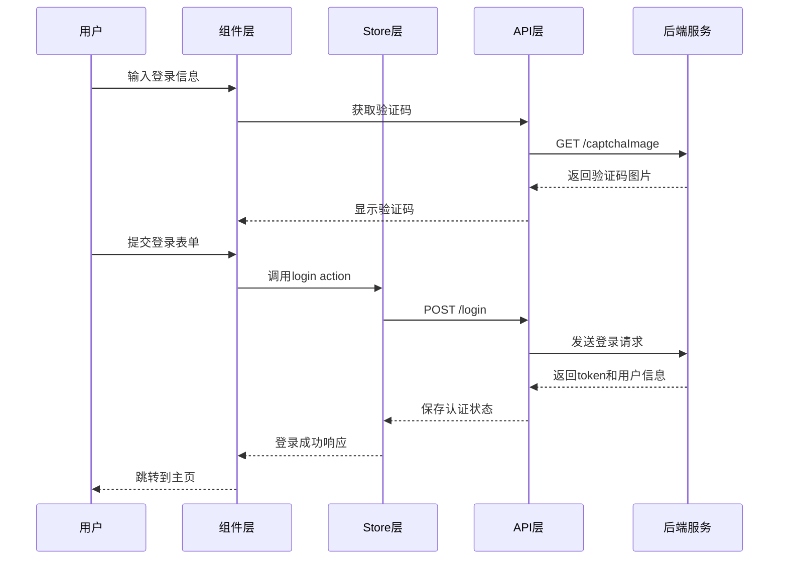
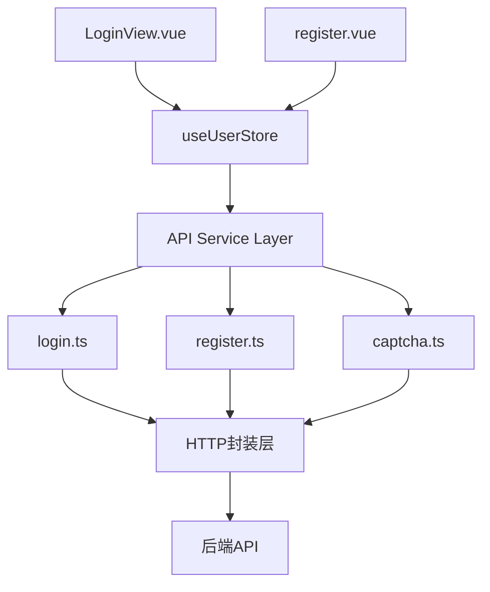
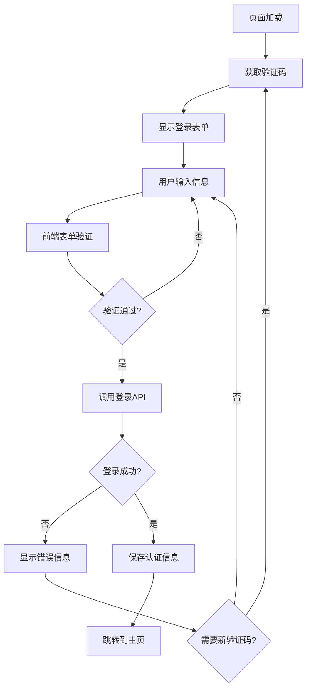
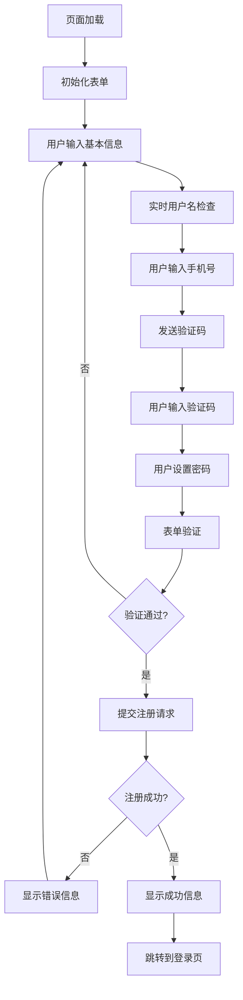

# 用户认证功能集成设计文档

## 1. 概述

### 1.1 设计目标

将现有的登录和注册组件从mock数据迁移到真实API接口，实现完整的用户认证流程。本设计专注于前端组件与已有API接口的集成，确保认证功能的可靠性和用户体验。

### 1.2 现状分析

**已完成部分：**

- ✅ API接口层完整实现 (`src/api/login.ts`, `src/api/register.ts`, `src/api/captcha.ts`)
- ✅ TypeScript类型定义完善 (`src/types/auth.ts`)
- ✅ HTTP请求封装 (`src/utils/request.ts`)
- ✅ 用户状态管理基础 (`src/stores/user.ts`)

**需要更新部分：**

- ❌ 登录组件使用mock数据 (`src/views/user/LoginView.vue`)
- ❌ 注册组件使用mock数据 (`src/views/user/register.vue`)
- ❌ 用户store需要适配新API
- ❌ 验证码获取和验证流程

## 2. 技术架构

### 2.1 认证流程架构



### 2.2 组件集成架构



## 3. 登录组件集成设计

### 3.1 状态管理更新

**现有问题：**

- Store中login方法使用旧的API路径
- 缺少验证码状态管理
- 错误处理不完整

**更新策略：**

```typescript
// stores/user.ts 更新
interface UserState {
  token: string | null;
  userInfo: UserInfo | null;
  isLoggedIn: boolean;
  captchaUuid: string | null;  // 新增验证码UUID
  captchaImage: string | null; // 新增验证码图片
}

// 新增actions
async getCaptcha() {
  const response = await getCodeImg();
  this.captchaUuid = response.data.uuid;
  this.captchaImage = response.data.img;
}

async login(loginData: LoginRequest) {
  const response = await loginWithData(loginData);
  this.token = response.data.token;
  this.userInfo = response.data.userInfo;
  this.isLoggedIn = true;
  // 保存token到localStorage
}
```

### 3.2 登录组件更新要点

**主要变更：**

1. **引入真实API**
   - 替换mock请求为真实API调用
   - 集成验证码获取逻辑
   - 使用store的login action

2. **验证码集成**
   - 组件挂载时自动获取验证码
   - 验证码刷新功能
   - 验证码显示和验证逻辑

3. **错误处理优化**
   - API错误码处理
   - 网络异常处理
   - 用户友好的错误提示

4. **表单验证更新**
   - 集成后端验证逻辑
   - 实时验证反馈
   - 防重复提交机制

### 3.3 登录流程设计



## 4. 注册组件集成设计

### 4.1 注册流程优化

**现有问题：**

- 使用setTimeout模拟注册
- 缺少真实API调用
- 没有注册结果处理

**更新策略：**

1. **API集成**
   - 使用register API
   - 添加用户名可用性检查
   - 集成手机验证码发送

2. **表单验证增强**
   - 实时用户名检查
   - 密码强度验证
   - 手机号格式验证

3. **用户体验优化**
   - 注册进度指示
   - 成功/失败状态反馈
   - 自动跳转逻辑

### 4.2 注册组件结构

```typescript
// 注册表单数据结构
interface RegisterForm {
  username: string; // 手机号
  password: string;
  confirmPassword: string;
  nickname: string;
  email: string;
  phone: string; // 冗余字段，与username相同
  code: string; // 验证码
  uuid: string; // 验证码UUID
}

// 组件状态
interface RegisterState {
  loading: boolean; // 注册中
  sendingCode: boolean; // 发送验证码中
  codeCountdown: number; // 验证码倒计时
  usernameChecking: boolean; // 用户名检查中
  usernameAvailable: boolean; // 用户名可用性
}
```

### 4.3 注册流程设计



## 5. 组件间状态同步

### 5.1 全局状态管理

```typescript
// stores/user.ts 完整设计
export const useUserStore = defineStore("user", {
  state: (): UserState => ({
    // 认证状态
    token: getStoredToken(),
    userInfo: getStoredUserInfo(),
    isLoggedIn: !!getStoredToken(),

    // 验证码状态
    captchaUuid: null,
    captchaImage: null,
    captchaTimestamp: null,

    // 注册状态
    registerStep: 0,
    tempRegisterData: null,
  }),

  actions: {
    // 验证码管理
    async refreshCaptcha() {
      const response = await getCodeImg();
      this.captchaUuid = response.data.uuid;
      this.captchaImage = `data:image/gif;base64,${response.data.img}`;
      this.captchaTimestamp = Date.now();
    },

    // 用户名检查
    async checkUsernameAvailability(username: string) {
      const response = await checkUsername(username);
      return response.data.available;
    },

    // 发送注册验证码
    async sendRegisterVerificationCode(phone: string) {
      await sendRegisterCode(phone);
    },

    // 用户注册
    async register(registerData: RegisterRequest) {
      const response = await register(registerData);
      return response;
    },

    // 用户登录
    async login(loginData: LoginRequest) {
      const response = await loginWithData(loginData);

      if (response.code === 200) {
        this.token = response.data.token;
        this.userInfo = response.data.userInfo;
        this.isLoggedIn = true;

        // 持久化存储
        setStoredToken(this.token);
        setStoredUserInfo(this.userInfo);
      }

      return response;
    },
  },
});
```

### 5.2 路由保护和重定向

```typescript
// router/index.ts 认证守卫
router.beforeEach((to, from, next) => {
  const userStore = useUserStore();

  if (to.meta.requiresAuth && !userStore.isLoggedIn) {
    next("/login");
  } else if (to.path === "/login" && userStore.isLoggedIn) {
    next("/");
  } else {
    next();
  }
});
```

## 6. 错误处理策略

### 6.1 API错误分类处理

```typescript
// 错误处理映射
const ERROR_MESSAGES = {
  // 登录错误
  401: "用户名或密码错误",
  423: "账户已被锁定，请联系管理员",
  429: "登录尝试过于频繁，请稍后重试",

  // 注册错误
  409: "用户名已存在",
  422: "输入信息格式不正确",

  // 验证码错误
  460: "验证码错误",
  461: "验证码已过期，请重新获取",

  // 网络错误
  500: "服务器内部错误，请稍后重试",
  503: "服务暂时不可用，请稍后重试",
};

// 错误处理函数
const handleApiError = (error: any, context: string) => {
  const code = error.response?.status || error.code;
  const message = ERROR_MESSAGES[code] || "网络连接异常，请检查网络后重试";

  ElMessage.error(`${context}失败：${message}`);

  // 特殊处理
  if (code === 401 && context === "登录") {
    // 清除可能的无效token
    userStore.logout();
  }
};
```

### 6.2 用户体验优化

```typescript
// 加载状态管理
interface LoadingState {
  login: boolean;
  register: boolean;
  captcha: boolean;
  usernameCheck: boolean;
  sendCode: boolean;
}

// 防抖处理
const debouncedUsernameCheck = debounce(async (username: string) => {
  if (username.length >= 6) {
    loadingState.usernameCheck = true;
    try {
      const available = await userStore.checkUsernameAvailability(username);
      usernameStatus.value = available ? "available" : "taken";
    } finally {
      loadingState.usernameCheck = false;
    }
  }
}, 500);
```

## 7. 安全考虑

### 7.1 前端安全措施

1. **Token管理**
   - 安全存储token（考虑使用httpOnly cookie）
   - Token过期自动刷新
   - 登出时彻底清除认证信息

2. **输入验证**
   - 前后端双重验证
   - XSS防护
   - 敏感信息脱敏显示

3. **请求安全**
   - CSRF保护
   - 请求频率限制
   - 敏感操作二次确认

### 7.2 隐私保护

```typescript
// 敏感信息处理
const maskPhone = (phone: string) => {
  return phone.replace(/(\d{3})\d{4}(\d{4})/, "$1****$2");
};

const logSecurely = (action: string, data: any) => {
  const sanitized = { ...data };
  delete sanitized.password;
  delete sanitized.token;
  console.log(`[${action}]`, sanitized);
};
```

## 8. 测试策略

### 8.1 单元测试要点

1. **API集成测试**
   - Mock API响应测试
   - 错误处理测试
   - 边界条件测试

2. **组件测试**
   - 表单验证测试
   - 用户交互测试
   - 状态变更测试

3. **Store测试**
   - 状态管理逻辑测试
   - 异步操作测试
   - 持久化存储测试

### 8.2 集成测试场景

```typescript
// 测试用例示例
describe("用户登录集成测试", () => {
  test("完整登录流程", async () => {
    // 1. 页面加载，获取验证码
    // 2. 输入用户信息
    // 3. 提交登录
    // 4. 验证状态变更
    // 5. 验证路由跳转
  });

  test("登录错误处理", async () => {
    // 1. 模拟各种错误场景
    // 2. 验证错误提示
    // 3. 验证状态恢复
  });
});
```
