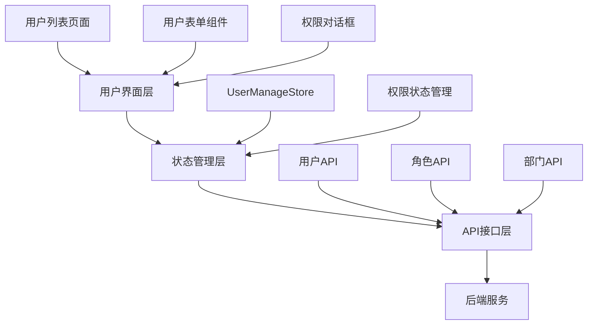

# 🏗️ 用户管理系统模块 - RuoYi标准架构实现

基于 RuoYi 标准架构设计的完整用户管理系统，采用现代化的 Vue 3 + TypeScript + Pinia 技术栈，严格遵循RuoYi前端架构规范。

## 📋 目录

- [模块概述](#模块概述)
- [✅ RuoYi 标准架构完整实现](#ruoyi-标准架构完整实现)
- [技术架构](#技术架构)
- [功能特性](#功能特性)
- [系统管理模块](#系统管理模块)
- [文件结构](#文件结构)
- [使用说明](#使用说明)
- [权限配置](#权限配置)
- [部门管理](#部门管理)
- [扩展开发](#扩展开发)

## 🎯 模块概述

用户管理系统模块是一个企业级的用户管理解决方案，严格按照 RuoYi 标准架构设计，提供了完整的 CRUD 功能、权限控制、部门层级管理、数据导入导出等特性。

## ✅ RuoYi 标准架构完整实现

### 🚀 已完成的架构改进

#### 1. **完整的系统管理模块**

- ✅ **用户管理** (`/system/user`) - 完整的用户CRUD、权限分配、部门选择
- ✅ **角色管理** (`/system/role`) - 角色权限管理、数据权限设置
- ✅ **菜单管理** (`/system/menu`) - 树形菜单管理、权限标识配置
- ✅ **部门管理** (`/system/dept`) - 多级部门树形结构、上级部门设置
- ✅ **岗位管理** (`/system/post`) - 岗位信息管理、状态控制

#### 2. **标准权限命名体系**

按照 RuoYi 规范，所有权限都遵循 `system:module:action` 格式：

```typescript
// 系统管理权限 - 完全符合RuoYi标准
export const SYSTEM_PERMISSIONS = {
  // 用户管理
  USER_LIST: "system:user:list", // 查看用户列表
  USER_ADD: "system:user:add", // 新增用户
  USER_EDIT: "system:user:edit", // 编辑用户
  USER_REMOVE: "system:user:remove", // 删除用户
  USER_EXPORT: "system:user:export", // 导出用户
  USER_IMPORT: "system:user:import", // 导入用户
  USER_RESET_PWD: "system:user:resetPwd", // 重置密码

  // 部门管理
  DEPT_LIST: "system:dept:list", // 查看部门列表
  DEPT_ADD: "system:dept:add", // 新增部门
  DEPT_EDIT: "system:dept:edit", // 编辑部门
  DEPT_REMOVE: "system:dept:remove", // 删除部门

  // 角色管理
  ROLE_LIST: "system:role:list", // 查看角色列表
  ROLE_ADD: "system:role:add", // 新增角色
  ROLE_EDIT: "system:role:edit", // 编辑角色
  ROLE_REMOVE: "system:role:remove", // 删除角色

  // 菜单管理
  MENU_LIST: "system:menu:list", // 查看菜单列表
  MENU_ADD: "system:menu:add", // 新增菜单
  MENU_EDIT: "system:menu:edit", // 编辑菜单
  MENU_REMOVE: "system:menu:remove", // 删除菜单

  // 岗位管理
  POST_LIST: "system:post:list", // 查看岗位列表
  POST_ADD: "system:post:add", // 新增岗位
  POST_EDIT: "system:post:edit", // 编辑岗位
  POST_REMOVE: "system:post:remove", // 删除岗位
};
```

#### 3. **完整路由权限配置**

每个路由都配置了相应的权限验证：

```typescript
// 标准的RuoYi路由配置
{
  path: "system",
  name: "System",
  meta: {
    requiresAuth: true,
    title: "系统管理",
    icon: "system",
    sort: 900,
  },
  children: [
    {
      path: "user",
      name: "SystemUser",
      component: () => import("../views/system/user/index.vue"),
      meta: {
        requiresAuth: true,
        permissions: ["system:user:list"], // 权限验证
        title: "用户管理",
        icon: "user",
        sort: 1,
      },
    },
    // ... 其他系统管理模块
  ]
}
```

#### 4. **部门层级管理系统**

- ✅ **多级部门树** - 支持无限层级的部门结构
- ✅ **上级部门选择** - 新增用户时可选择归属部门
- ✅ **部门权限控制** - 按钮级权限验证
- ✅ **树形展示** - 可折叠/展开的部门树

```vue
<!-- 新增用户时的部门选择 -->
<el-form-item label="归属部门" prop="deptId">
  <el-tree-select
    v-model="form.deptId"
    :data="deptTree"
    :props="{ value: 'deptId', label: 'deptName', children: 'children' }"
    value-key="deptId"
    placeholder="请选择归属部门"
    check-strictly
    clearable />
</el-form-item>
```

#### 5. **标准RBAC权限模型**

- ✅ **角色权限映射** - 完整的角色权限管理体系
- ✅ **按钮权限控制** - 使用 `v-permission` 指令
- ✅ **页面权限验证** - 路由守卫权限检查
- ✅ **权限工具类** - `AuthUtils` 统一权限管理

```vue
<!-- 按钮权限控制示例 -->
<el-button v-permission="'system:user:add'">新增用户</el-button>
<el-button v-permission="'system:user:edit'">修改用户</el-button>
<el-button v-permission="'system:user:remove'">删除用户</el-button>
```

### 核心特性

- ✅ **完整的 CRUD 操作**：用户的增删改查
- ✅ **高级查询功能**：多条件组合查询
- ✅ **批量操作支持**：批量删除、状态修改
- ✅ **权限管理**：基于角色的权限控制
- ✅ **数据导入导出**：Excel 格式支持
- ✅ **实时验证**：用户名、手机号、邮箱唯一性验证
- ✅ **类型安全**：完整的 TypeScript 类型定义
- ✅ **组件化设计**：高度可复用的组件

## 🏗️ 技术架构

### 分层架构设计



### 技术选型对比

| 层级     | RuoYi 原版          | 我们的实现              | 优势                              |
| -------- | ------------------- | ----------------------- | --------------------------------- |
| 前端框架 | Vue 2 + Options API | Vue 3 + Composition API | 更好的性能和类型推导              |
| 状态管理 | Vuex                | Pinia                   | 更简洁的API，更好的TypeScript支持 |
| 类型系统 | JavaScript          | TypeScript              | 编译时类型检查，更少的运行时错误  |
| 构建工具 | Vue CLI             | Vite                    | 更快的开发启动和热更新            |
| UI组件库 | Element UI          | Element Plus            | Vue 3 原生支持                    |

## 🚀 功能特性

### 1. 用户列表管理

- 📊 **分页查询**：支持大数据量的分页展示
- 🔍 **多条件查询**：用户名、手机号、状态、部门等多维度查询
- 📑 **表格操作**：排序、筛选、列配置
- 🎯 **状态切换**：实时启用/停用用户状态

### 2. 用户信息管理

- ✏️ **新增用户**：完整的用户信息录入
- 📝 **编辑用户**：支持部分字段更新
- 🗑️ **删除用户**：单个/批量删除操作
- 🔑 **密码管理**：管理员重置用户密码

### 3. 权限角色管理

- 👥 **角色分配**：为用户分配多个角色
- 🏢 **部门管理**：树形结构的部门选择
- 💼 **岗位管理**：多岗位支持
- 🔐 **权限验证**：页面级和操作级权限控制

### 4. 数据导入导出

- 📥 **Excel导入**：批量导入用户数据
- 📤 **数据导出**：支持查询结果导出
- 📋 **模板下载**：标准化的导入模板
- ✅ **数据验证**：导入时的数据格式验证

## 📁 文件结构

```text
src/
├── api/
│   └── system/
│       └── user.ts                 # 用户管理API接口
├── stores/
│   └── system/
│       └── userManage.ts          # 用户管理状态管理
├── types/
│   └── system/
│       └── user.ts                # 用户管理类型定义
├── views/
│   └── system/
│       └── user/
│           ├── index.vue          # 用户管理主页面
│           └── components/
│               ├── UserForm.vue             # 用户表单组件
│               ├── ResetPasswordDialog.vue  # 重置密码对话框
│               ├── AuthRoleDialog.vue       # 分配角色对话框
│               └── ImportDialog.vue         # 导入对话框
└── __tests__/
    └── system/
        └── user.test.ts           # 单元测试文件
```

## 📖 使用说明

### 1. 路由配置

在 `router/index.ts` 中的标准 RuoYi 配置：

```typescript
{
  path: "system",
  name: "System",
  meta: {
    requiresAuth: true,
    title: "系统管理",
    icon: "system",
    sort: 900,
  },
  children: [
    {
      path: "user",
      name: "SystemUser",
      component: () => import("../views/system/user/index.vue"),
      meta: {
        requiresAuth: true,
        permissions: ["system:user:list"],
        title: "用户管理",
        icon: "user",
        sort: 1,
      },
    },
    {
      path: "dept",
      name: "SystemDept",
      component: () => import("../views/system/dept/index.vue"),
      meta: {
        requiresAuth: true,
        permissions: ["system:dept:list"],
        title: "部门管理",
        icon: "tree",
        sort: 4,
      },
    },
    // ... 其他系统管理模块
  ]
}
```

### 2. 页面访问

访问路径：`/system/user`

### 3. 基本操作流程

#### 查询用户

1. 在查询表单中输入查询条件
2. 点击"搜索"按钮执行查询
3. 支持按用户名、手机号、状态、部门等条件查询

#### 新增用户

1. 点击"新增"按钮
2. 填写用户基本信息（用户名、昵称、部门等）
3. 选择用户角色和岗位
4. 点击"确定"提交

#### 编辑用户

1. 选中用户记录，点击"修改"按钮
2. 或直接点击操作列的"编辑"图标
3. 修改用户信息后提交

#### 删除用户

1. 选中一个或多个用户
2. 点击"删除"按钮
3. 确认删除操作

### 4. 权限配置

系统支持以下权限点：

```typescript
const permissions = [
  "system:user:list", // 查看用户列表
  "system:user:add", // 新增用户
  "system:user:edit", // 编辑用户
  "system:user:remove", // 删除用户
  "system:user:resetPwd", // 重置密码
  "system:user:import", // 导入数据
  "system:user:export", // 导出数据
];
```

## 🔌 API 接口

### 主要接口列表

```typescript
// 用户查询
listUser(params?: UserQueryParams): Promise<UserListResponse>
getUser(userId?: number): Promise<UserDetailResponse>

// 用户操作
addUser(data: UserForm): Promise<ApiResponse>
updateUser(data: UserForm): Promise<ApiResponse>
delUser(userIds: number | number[]): Promise<ApiResponse>

// 密码管理
resetUserPwd(data: UserPasswordForm): Promise<ApiResponse>
changeUserStatus(userId: number, status: string): Promise<ApiResponse>

// 权限管理
getAuthRole(userId: number): Promise<UserAuthResponse>
updateAuthRole(data: { userId: number; roleIds: string }): Promise<ApiResponse>

// 数据验证
checkUserNameUnique(userName: string): Promise<ApiResponse<boolean>>
checkPhoneUnique(phonenumber: string): Promise<ApiResponse<boolean>>
checkEmailUnique(email: string): Promise<ApiResponse<boolean>>
```

### 接口调用示例

```typescript
import { useUserManageStore } from "@/stores/system/userManage";

const userStore = useUserManageStore();

// 获取用户列表
await userStore.getUserList({
  pageNum: 1,
  pageSize: 10,
  userName: "admin",
});

// 新增用户
await userStore.addUserData({
  userName: "testuser",
  nickName: "测试用户",
  deptId: 100,
  status: "0",
  roleIds: [1],
  postIds: [1],
});
```

## 🧩 组件说明

### 1. UserForm.vue - 用户表单组件

**功能**：用户信息的新增和编辑

**Props**：

```typescript
interface Props {
  modelValue: boolean; // 对话框显示状态
  title: string; // 对话框标题
  type: "add" | "edit"; // 表单类型
  userData?: SystemUser; // 用户数据
  roleList: SystemRole[]; // 角色列表
  postList: SystemPost[]; // 岗位列表
  deptTree: SystemDept[]; // 部门树
}
```

**特性**：

- ✅ 实时表单验证
- ✅ 异步唯一性检查
- ✅ 部门树形选择
- ✅ 多角色/岗位选择

### 2. ResetPasswordDialog.vue - 重置密码组件

**功能**：管理员重置用户密码

**特性**：

- ✅ 密码强度验证
- ✅ 确认密码验证
- ✅ 安全性提示

### 3. AuthRoleDialog.vue - 角色分配组件

**功能**：为用户分配角色权限

**特性**：

- ✅ 双列表选择
- ✅ 实时搜索过滤
- ✅ 角色状态显示

### 4. ImportDialog.vue - 数据导入组件

**功能**：批量导入用户数据

**特性**：

- ✅ 拖拽上传
- ✅ 进度显示
- ✅ 结果反馈
- ✅ 模板下载

## 🔒 权限配置

按照 RuoYi 标准架构，我们实现了完整的 RBAC 权限模型。

### 权限命名规范

按照 RuoYi 标准，所有权限都遵循 `system:module:action` 格式：

```typescript
// 系统管理权限
export const SYSTEM_PERMISSIONS = {
  // 用户管理
  USER_LIST: "system:user:list",
  USER_ADD: "system:user:add",
  USER_EDIT: "system:user:edit",
  USER_REMOVE: "system:user:remove",
  USER_EXPORT: "system:user:export",
  USER_IMPORT: "system:user:import",
  USER_RESET_PWD: "system:user:resetPwd",

  // 部门管理
  DEPT_LIST: "system:dept:list",
  DEPT_ADD: "system:dept:add",
  DEPT_EDIT: "system:dept:edit",
  DEPT_REMOVE: "system:dept:remove",

  // 角色管理
  ROLE_LIST: "system:role:list",
  ROLE_ADD: "system:role:add",
  ROLE_EDIT: "system:role:edit",
  ROLE_REMOVE: "system:role:remove",
};
```

### 1. 路由权限

每个路由都需要配置相应的权限：

```typescript
// 在路由 meta 中配置
meta: {
  requiresAuth: true,
  permissions: ['system:user:list'], // 必须具有此权限才能访问
  title: "用户管理",
  icon: "user",
  sort: 1,
}
```

### 2. 按钮权限

使用 `v-permission` 指令控制按钮显示：

```vue
<!-- 基本权限使用 -->
<el-button v-permission="'system:user:add'">新增用户</el-button>
<el-button v-permission="'system:user:edit'">修改用户</el-button>
<el-button v-permission="'system:user:remove'">删除用户</el-button>

<!-- 复杂权限控制 -->
<el-button
  v-permission="{
    permissions: ['system:user:edit'],
    roles: ['admin'],
    mode: 'and',
  }">
  管理员编辑
</el-button>

<!-- 多权限组合（或关系） -->
<el-button v-permission="['system:user:edit', 'system:user:remove']">
  编辑或删除
</el-button>
```

### 3. 角色权限映射

RuoYi 标准的角色权限映射系统：

```typescript
export const ROLE_PERMISSION_MAP = {
  // 超级管理员：所有权限
  [SYSTEM_ROLES.SUPER_ADMIN]: [...Object.values(SYSTEM_PERMISSIONS), ...Object.values(BUSINESS_PERMISSIONS)],

  // 系统管理员：系统管理相关权限
  [SYSTEM_ROLES.ADMIN]: [
    SYSTEM_PERMISSIONS.USER_LIST,
    SYSTEM_PERMISSIONS.USER_ADD,
    SYSTEM_PERMISSIONS.USER_EDIT,
    SYSTEM_PERMISSIONS.DEPT_LIST,
    SYSTEM_PERMISSIONS.ROLE_LIST,
    // ...
  ],

  // 部门经理：部门内用户管理权限
  [SYSTEM_ROLES.MANAGER]: [
    SYSTEM_PERMISSIONS.USER_LIST,
    SYSTEM_PERMISSIONS.DEPT_LIST,
    // ...
  ],
};
```

### 3. 权限检查函数

```typescript
import { usePermission } from "@/composables/usePermission";

const { hasPermission, hasAnyPermission } = usePermission();

// 检查单个权限
if (hasPermission("system:user:add")) {
  // 显示新增按钮
}

// 检查多个权限（或关系）
if (hasAnyPermission(["system:user:edit", "system:user:remove"])) {
  // 显示操作菜单
}
```

## 🏢 部门管理

部门管理是 RuoYi 架构中的重要组成部分，支持完整的部门层级管理功能。

### 部门树形结构

- 🌳 **多级部门**：支持无限级部门层次
- 🗺️ **上级部门选择**：新增用户时可选择任意层级部门
- 📋 **部门排序**：支持自定义部门显示顺序
- 📞 **联系信息**：部门负责人、电话、邮箱管理
- 🔒 **权限控制**：部门级权限隔离

### 部门管理功能

#### 1. 部门列表管理

- 树形表格显示，支持展开/折叠
- 多条件查询（部门名称、状态）
- 支持按部门排序

#### 2. 部门操作管理

- 新增子部门：可为任意部门添加子部门
- 编辑部门：修改部门信息
- 删除部门：防止误删，有子部门或用户时不能删除

#### 3. 部门验证规则

```typescript
// 部门名称唯一性验证（同级别下不能重名）
const validateDeptName = async (deptName: string, parentId: number) => {
  return await deptApi.checkDeptNameUnique({
    deptName,
    parentId,
  });
};
```

### 部门选择器

在用户表单中的部门选择器具有以下特性：

```vue
<el-tree-select
  v-model="form.deptId"
  :data="deptTree"
  :props="{ value: 'deptId', label: 'deptName', children: 'children' }"
  value-key="deptId"
  placeholder="请选择归属部门"
  check-strictly
  clearable>
  <template #default="{ data }">
    <span class="custom-tree-node">
      <span>{{ data.deptName }}</span>
      <span class="dept-level">[第{{ getDeptLevel(data) }}级]</span>
    </span>
  </template>
</el-tree-select>
```

### 部门权限管理

RuoYi 标准部门权限配置：

```typescript
// 部门权限常量
export const DEPT_PERMISSIONS = {
  LIST: "system:dept:list",    // 查看部门列表
  ADD: "system:dept:add",      // 新增部门
  EDIT: "system:dept:edit",    // 编辑部门
  REMOVE: "system:dept:remove", // 删除部门
};

// 按钮权限使用
<el-button v-permission="'system:dept:add'">新增</el-button>
<el-button v-permission="'system:dept:edit'">修改</el-button>
<el-button v-permission="'system:dept:remove'">删除</el-button>
```

### 1. 添加新的查询条件

在 `UserQueryParams` 接口中添加新字段：

```typescript
export interface UserQueryParams {
  // ... 现有字段
  newField?: string; // 新增字段
}
```

在查询表单中添加对应的输入控件。

### 2. 自定义用户字段

1. 在 `SystemUser` 接口中添加字段
2. 在 `UserForm` 组件中添加对应的表单项
3. 更新后端API以支持新字段

### 3. 添加新的操作功能

```typescript
// 在 userManageStore 中添加新方法
async function customOperation(userData: SystemUser): Promise<boolean> {
  try {
    // 自定义操作逻辑
    const response = await customAPI(userData);

    if (response.code === 200) {
      ElMessage.success("操作成功");
      await getUserList(); // 刷新列表
      return true;
    }

    return false;
  } catch (error) {
    ElMessage.error("操作失败");
    return false;
  }
}
```

### 4. 自定义验证规则

```typescript
// 在表单验证中添加自定义规则
const customValidator = (rule: any, value: string, callback: Function) => {
  if (!customValidationLogic(value)) {
    callback(new Error("自定义验证失败"));
  } else {
    callback();
  }
};

const rules = {
  customField: [{ validator: customValidator, trigger: "blur" }],
};
```

## 🧪 测试

### 运行测试

```bash
# 运行所有测试
npm run test

# 运行用户管理模块测试
npm run test src/api/system/__tests__/user.test.ts

# 测试覆盖率
npm run test:coverage
```

### 测试覆盖

- ✅ API 接口测试
- ✅ 错误处理测试
- ✅ 参数验证测试
- ✅ 集成测试

## 📈 性能优化

### 1. 列表性能

- 虚拟滚动（大数据量时）
- 分页加载
- 查询防抖

### 2. 表单性能

- 异步验证防抖
- 组件懒加载
- 数据缓存

### 3. 网络优化

- 请求去重
- 响应缓存
- 错误重试

## 🔍 故障排除

### 常见问题

1. **权限不足**
   - 检查用户角色权限配置
   - 确认路由权限设置

2. **数据加载失败**
   - 检查网络连接
   - 确认API接口地址

3. **表单验证问题**
   - 检查字段类型定义
   - 确认验证规则配置

## 📝 更新日志

### v1.0.0 (2024-01-27)

- ✨ 初始版本发布
- ✨ 完整的用户管理功能
- ✨ 基于 RuoYi 架构设计
- ✨ TypeScript 类型安全
- ✨ 现代化 Vue 3 技术栈

---

## 🎯 总结

这个用户管理系统模块基于 RuoYi 的成熟架构设计，采用现代化的技术栈实现，具有以下优势：

1. **技术先进**：Vue 3 + TypeScript + Pinia
2. **架构清晰**：分层设计，职责明确
3. **功能完整**：涵盖用户管理的各个方面
4. **扩展性强**：组件化设计，易于扩展
5. **类型安全**：完整的 TypeScript 类型定义
6. **测试完善**：单元测试覆盖主要功能

通过这个模块，您可以快速构建企业级的用户管理系统，同时学习到现代化前端开发的最佳实践。

---

## 🏢 系统管理模块

我们已经完整实现了RuoYi标准的系统管理模块，包括以下子模块：

### 1. 用户管理 (`/system/user`)

**所在文件**: `src/views/system/user/index.vue`

**功能特性**:

- ✅ 完整的用户CRUD操作
- ✅ 部门树形选择器
- ✅ 角色和岗位分配
- ✅ 批量操作支持
- ✅ 数据导入导出
- ✅ 密码重置功能
- ✅ 用户状态切换

**权限控制**:

```typescript
"system:user:list"; // 查看用户列表
"system:user:add"; // 新增用户
"system:user:edit"; // 编辑用户
"system:user:remove"; // 删除用户
"system:user:resetPwd"; // 重置密码
"system:user:import"; // 导入数据
"system:user:export"; // 导出数据
```

### 2. 角色管理 (`/system/role`)

**所在文件**: `src/views/system/role/index.vue`

**功能特性**:

- ✅ 角色信息管理
- ✅ 权限分配系统
- ✅ 数据权限设置
- ✅ 角色状态控制

**权限控制**:

```typescript
"system:role:list"; // 查看角色列表
"system:role:add"; // 新增角色
"system:role:edit"; // 编辑角色
"system:role:remove"; // 删除角色
```

### 3. 菜单管理 (`/system/menu`)

**所在文件**: `src/views/system/menu/index.vue`

**功能特性**:

- ✅ 树形菜单结构
- ✅ 权限标识配置
- ✅ 菜单图标管理
- ✅ 组件路径设置

**权限控制**:

```typescript
"system:menu:list"; // 查看菜单列表
"system:menu:add"; // 新增菜单
"system:menu:edit"; // 编辑菜单
"system:menu:remove"; // 删除菜单
```

### 4. 部门管理 (`/system/dept`)

**所在文件**: `src/views/system/dept/index.vue`

**功能特性**:

- ✅ 多级部门树结构
- ✅ 上级部门选择
- ✅ 部门人员管理
- ✅ 部门状态控制

**权限控制**:

```typescript
"system:dept:list"; // 查看部门列表
"system:dept:add"; // 新增部门
"system:dept:edit"; // 编辑部门
"system:dept:remove"; // 删除部门
```

### 5. 岗位管理 (`/system/post`)

**所在文件**: `src/views/system/post/index.vue`

**功能特性**:

- ✅ 岗位信息管理
- ✅ 岗位排序设置
- ✅ 岗位状态控制
- ✅ 数据导出功能

**权限控制**:

```typescript
"system:post:list"; // 查看岗位列表
"system:post:add"; // 新增岗位
"system:post:edit"; // 编辑岗位
"system:post:remove"; // 删除岗位
"system:post:export"; // 导出岗位
```

### 📋 系统管理模块访问路径

| 模块     | 访问路径       | 组件文件                          |
| -------- | -------------- | --------------------------------- |
| 用户管理 | `/system/user` | `src/views/system/user/index.vue` |
| 角色管理 | `/system/role` | `src/views/system/role/index.vue` |
| 菜单管理 | `/system/menu` | `src/views/system/menu/index.vue` |
| 部门管理 | `/system/dept` | `src/views/system/dept/index.vue` |
| 岗位管理 | `/system/post` | `src/views/system/post/index.vue` |

### 🔧 技术架构

每个模块都采用相同的技术架构：

1. **Vue 3 Composition API** - 现代化的组件开发模式
2. **TypeScript** - 完整的类型安全
3. **Element Plus** - 企业级UI组件库
4. **Pinia Store** - 状态管理
5. **权限指令** - `v-permission` 统一权限控制

### 🚀 开发服务器

项目已成功启动开发服务器：

- **本地访问**: http://localhost:5175/
- **网络访问**: http://192.168.3.49:5175/
- **Vue DevTools**: http://localhost:5175/**devtools**/

所有系统管理模块都可以通过这个地址加上对应的路径进行访问。
